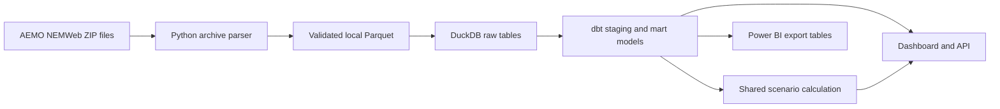

# Australian Energy Decision Platform

An end-to-end portfolio project using public Australian Energy Market Operator data to examine Queensland wholesale electricity prices and test a **hypothetical** small-business load shift. It combines Python ingestion, data checks, a DuckDB warehouse, dbt SQL models, an API, and an interactive decision view.

The central question is: **How would moving a fixed amount of electricity use from 16:00–18:00 to 11:00–13:00 have changed historical wholesale-price exposure, and how consistently?** The default business profile is invented for demonstration. Results are not retail-bill savings or advice to a real customer.

**Observed result:** In the 91-day reserved holdout period, 75 days had complete `FIRM` price data. On those days, the fixed shift reduced calculated wholesale exposure from **$291.74 to $236.43**, a **$55.31 (18.96%)** difference. The alternative was lower on each of the 75 included days. This is a retrospective result for one invented load profile; see the [client memo](reports/client_memo.md) for the coverage sensitivity and decision limits.

## Current scope

- Queensland NEM region (`QLD1`), 14 September 2025–12 September 2026.
- Five-minute firm trading prices from AEMO NEMWeb TradingIS archives.
- Separate half-hour actual operational demand from AEMO's Operational Demand files.
- Fixed, equal-energy schedule comparison on complete days. The selected schedule is evaluated on a later holdout period beginning 14 June 2026.
- Original source files, large BI exports, and the local database are excluded from Git. A small, derived [Power BI report dataset](powerbi/data/) is included for the Windows handoff. Source download addresses and checksums are stored in the local manifest.

See [source audit](docs/source_audit.md), [methodology](docs/methodology.md), and [data dictionary](docs/data_dictionary.md) for definitions and limitations.

## Reproduce locally

Use Python 3.11 or newer from the project root:

```bash
python3 -m venv .venv
source .venv/bin/activate
pip install -e '.[dev]'
energy-platform sync
energy-platform prepare
energy-platform build
energy-platform evaluate
energy-platform export-bi
energy-platform package-bi
```

The first command downloads about 90 MB of archived ZIP files and a small set of demand files. `prepare` checks the source hashes and extracts Queensland records into local Parquet files. `build` loads the prepared records into DuckDB, then runs dbt models and tests. `evaluate` writes the holdout result to `reports/holdout_result.json`.

`package-bi` creates the compact CSV set and checksum manifest in `powerbi/data/`. That snapshot is already committed, so Power BI Desktop on Windows can import it without repeating the AEMO download. See the [Power BI handoff](powerbi/README.md) for the model, measures, report pages, and reconciliation figures.

`sync` reuses cached source files and records their retrieval time, URL, size, and checksum. Use `energy-platform sync --refresh` to fetch the source files again when checking for upstream revisions.

To test the pipeline on a shorter period first, run `energy-platform sync --start 2026-08-01 --end 2026-08-31`, followed by `prepare` and `build`. The `evaluate` command should be used on a period that includes the holdout dates.

Launch the applications after `build`:

```bash
streamlit run dashboard/app.py
uvicorn energy_platform.api:app --reload
```

The Streamlit interface defaults to <http://localhost:8501>. FastAPI documentation is at <http://localhost:8000/docs>.

Alternatively, after preparing and building the local warehouse, run `docker compose up --build` to serve the dashboard at <http://localhost:8502> and the API at <http://localhost:8001/docs>. Compose mounts the locally built data read-only; it does not fetch AEMO data inside the containers.

Offline verification:

```bash
python -m pytest -q
python -m compileall -q src dashboard
```

The same offline checks run in GitHub Actions. A live-data refresh is separate because network and source availability can change.

## Data flow



The price and demand series retain their separate interval lengths. Scenario exposure uses five-minute prices only. Regional demand provides market context and is not the example business's load.

## Portfolio evidence

| Skill | Inspect |
| --- | --- |
| Python ingestion and repeatability | `src/energy_platform/aemo.py`, source manifest |
| SQL and data modelling | `dbt/models/` and dbt data tests |
| Analytical validation | `src/energy_platform/scenario.py`, `tests/`, `docs/methodology.md` |
| API development | `src/energy_platform/api.py`, `/docs` |
| Business communication | `reports/client_memo.md` and dashboard |
| BI preparation | `energy-platform package-bi`, `powerbi/data/`, `powerbi/README.md` |

Power BI Desktop requires Windows. The repository includes a locally authored four-page `.pbix`, its six-table snapshot, DAX measures, and a [build and verification guide](powerbi/AUTHORING_GUIDE.md). The report was saved, reopened in Desktop, and reconciled to the committed holdout totals.

## Sources

- [AEMO Dispatch and Trading report documentation](https://www.aemo.com.au/energy-systems/electricity/national-electricity-market-nem/data-nem/market-management-system-mms-data/dispatch)
- [AEMO Operational Demand data](https://www.aemo.com.au/energy-systems/electricity/national-electricity-market-nem/data-nem/operational-demand-data)
- [AER explanation of electricity-bill components](https://www.aer.gov.au/system/files/2025-08/State%20of%20the%20energy%20market%202025%20-%20Chapter%206%20-%20Retail%20energy%20markets%20and%20energy%20consumers.pdf)
