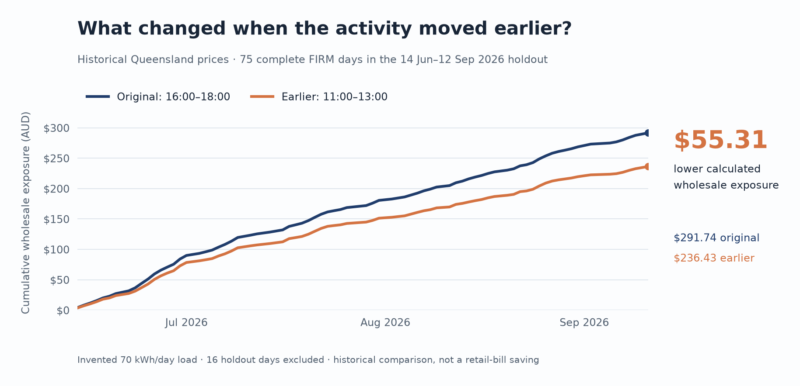
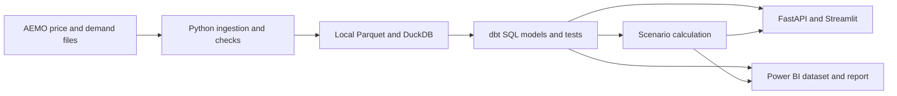

# Australian Energy Decision Platform

**Can moving a two-hour activity change a business's exposure to wholesale electricity prices?**

I chose this question because some business activities can move to a different time of day, while electricity prices vary sharply within it. A useful answer needs more than an average price: it needs trustworthy source data, an equal-energy comparison, and a clear account of the tariff and operating constraints that could change the decision. AEMO's public data lets me work through that problem from raw files to a result someone can check.

I built a Python and SQL pipeline for Queensland market data, tested a fixed scheduling scenario, and presented the result through an API, a Streamlit app, and a [four-page Power BI report](powerbi/queensland_energy_market.pbix). The business and its electricity use are **invented**; the comparison measures historical wholesale-price exposure, not a customer's bill.

## The short answer

I compared a 5 kW activity running from **16:00–18:00** with the same activity running from **11:00–13:00**. Both schedules use **70 kWh per day** including an unchanged background load. I fixed the schedules before evaluating the later holdout period.

| Holdout result | Value |
| --- | ---: |
| Period | 14 June–12 September 2026 |
| Days with complete `FIRM` prices | 75 of 91 |
| Original schedule, calculated wholesale exposure | $291.74 |
| Earlier schedule, calculated wholesale exposure | $236.43 |
| Difference | **$55.31 (18.96%)** |

The earlier schedule had lower calculated exposure on all **75 included days**. That is an interesting historical pattern, but **$55.31 is not a bill saving**. A real business may be on a fixed retail tariff, may not be able to move the activity, or may face costs that outweigh the difference. The [decision brief](reports/client_memo.md) explains what I would need before making a recommendation.



This figure is rendered from the committed [daily scenario results](powerbi/data/scenario_daily.csv) with [a small plotting script](scripts/render_readme_chart.py); it is not a screenshot or a forecast.

## What I built



- **Data pipeline:** Downloads AEMO report archives, records file hashes, parses five-minute Queensland prices and half-hour regional demand, and keeps the two series at their own time grains.
- **Warehouse and checks:** Builds DuckDB tables and dbt models. Duplicate intervals, missing observations, and incomplete price days are visible rather than filled in quietly.
- **Decision example:** Compares equal-energy schedules on complete `FIRM` price days. An independent SQL calculation checks the Python result.
- **Ways to explore it:** The [Power BI report](powerbi/README.md) is the easiest visual entry point. The [Streamlit app](dashboard/app.py) and [FastAPI service](src/energy_platform/api.py) expose the same prepared analysis locally.

The hourly Power BI heatmap covers the **whole loaded period**, so its values do not change with a daily date slicer. Regional demand is market context, not the invented business's meter profile. Those distinctions matter more than making every visual respond to every filter.

## Where to start

1. Preview the [four Power BI pages](powerbi/README.md#report-preview), or open the [report file](powerbi/queensland_energy_market.pbix) in Power BI Desktop on Windows.
2. Read the [decision brief](reports/client_memo.md) for the result, sensitivity, and practical limits.
3. Look at the [methodology](docs/methodology.md) and [independent result check](reports/verification.md) if you want to see how the numbers were produced.

The repository includes six small, derived [Power BI input tables](powerbi/data/) and their checksum manifest. Raw AEMO archives, the local DuckDB database, and large exports are left out of Git. You can inspect the report without downloading the raw files.

## Reproduce the pipeline

Use Python **3.11+** from the repository root. A full source refresh downloads roughly 90 MB of archives and requires AEMO's files to be available.

```bash
python3 -m venv .venv
source .venv/bin/activate
pip install -e '.[dev]'
energy-platform sync
energy-platform prepare
energy-platform build
energy-platform evaluate
energy-platform export-bi
energy-platform package-bi
```

`sync` caches each source and records its URL, retrieval time, size, and SHA-256 hash. `prepare` validates and extracts the data; `build` loads DuckDB and runs dbt; `evaluate` writes the scenario result. `package-bi` recreates the committed small CSV snapshot and manifest. Use `energy-platform sync --refresh` when you intentionally want to check for changed upstream files.

To explore the built warehouse locally:

```bash
streamlit run dashboard/app.py
uvicorn energy_platform.api:app --reload
```

The app opens at <http://localhost:8501> and the API documentation at <http://localhost:8000/docs>. Docker Compose is also available after the warehouse is built: `docker compose up --build` serves the app at <http://localhost:8502> and the API at <http://localhost:8001/docs>. The containers read the local prepared data; they do not download it for you.

For a quicker offline check, run `python -m pytest -q`. The same Python checks run in [GitHub Actions](.github/workflows/checks.yml). The [local runbook](docs/runbook.md) covers rebuilds and troubleshooting.

To regenerate the README figure: `pip install -e '.[visuals]'` then `python scripts/render_readme_chart.py`.

## What I would do with real business data

The current result is a **screening calculation**, not an operating instruction. I would next obtain interval meter readings, the actual retail tariff or contract, the activity's flexibility and rescheduling cost, and a longer range of market conditions. I would then recalculate the exposure that could reach the bill and test days where shifting performs worse. The [source audit](docs/source_audit.md) records why 16 holdout days were excluded from the confirmed-price result.

## Sources

- [AEMO Dispatch and Trading reports](https://www.aemo.com.au/energy-systems/electricity/national-electricity-market-nem/data-nem/market-management-system-mms-data/dispatch)
- [AEMO Operational Demand](https://www.aemo.com.au/energy-systems/electricity/national-electricity-market-nem/data-nem/operational-demand-data)
- [AER explanation of retail bill components](https://www.aer.gov.au/system/files/2025-08/State%20of%20the%20energy%20market%202025%20-%20Chapter%206%20-%20Retail%20energy%20markets%20and%20energy%20consumers.pdf)
