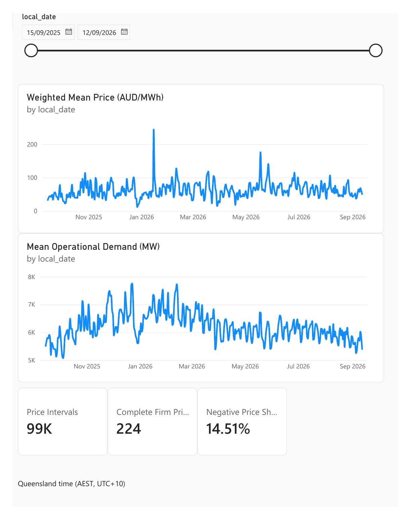
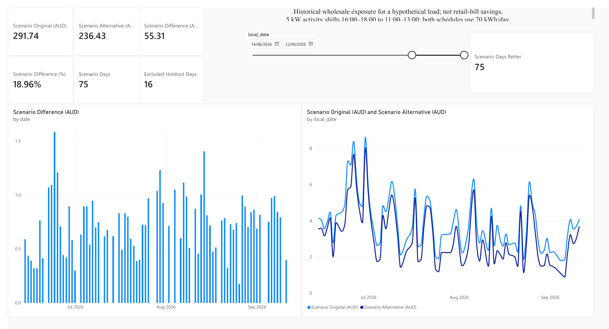

# Explore the Power BI report

Open [queensland_energy_market.pbix](queensland_energy_market.pbix) in [Power BI Desktop for Windows](https://learn.microsoft.com/en-us/power-bi/fundamentals/desktop-get-the-desktop). The report was saved, closed, reopened, and checked against the source tables on Windows. It uses a small committed snapshot, so opening it does not require a new AEMO download or a Power BI service account.

| Page | What to look for |
| --- | --- |
| **Market Overview** | Daily wholesale prices beside regional operational demand, with date and data-coverage context. They are separate series with different units. |
| **Price risk** | Daily high-price and negative-price patterns, plus a weekday/hour heatmap. The heatmap covers the full snapshot and deliberately ignores the daily date slicer. |
| **Scenario** | The invented 5 kW activity moved from 16:00–18:00 to 11:00–13:00. Cards and daily charts compare historical wholesale exposure on complete `FIRM` price days. |
| **Definitions** | Source, units, completeness rules, assumptions, and exclusions needed to interpret the other pages. |

With the Scenario slicer set to **14 June–12 September 2026**, the reopened report shows **$291.74** for the original schedule, **$236.43** for the earlier schedule, and a **$55.31 (18.96%)** difference across **75 included days**; **16 days** were excluded. These are historical wholesale calculations for a hypothetical load, **not customer bill savings**.

## Report preview

These images were exported from the saved Windows report. Market Overview and Price risk use the full **14 September 2025–12 September 2026** snapshot; Scenario uses the holdout dates above.

**Market Overview:** daily price and regional demand, shown on separate scales. The full period has 225 complete `FIRM` price days.

**Scenario:** the historical comparison of two equal-energy schedules. The cards show $291.74 and $236.43 across 75 included days, with a $55.31 difference.

The other pages show [price risk and the weekday/hour matrix](../docs/images/powerbi-price-risk.png) and [definitions and data-quality notes](../docs/images/powerbi-definitions.png).

## What is inside

The report imports six derived [CSV tables](data/): a date table, a Queensland region row, daily price and demand summaries, full-period weekday/hour price summaries, and daily scenario results. [AUTHORING_GUIDE.md](AUTHORING_GUIDE.md) lists the model relationships, DAX measures, page fields, and the checks completed in Desktop. The source definitions are in [queensland_energy_market.dax](queensland_energy_market.dax); [create_and_check_measures.dax](create_and_check_measures.dax) records the DAX Query View script used during the build.

The [checksum manifest](data/manifest.json) makes the snapshot auditable. On Windows, `./powerbi/verify_powerbi_inputs.ps1 -RepoPath .` checks the files, keys, and holdout figures against the committed result JSON. The detailed five-minute price facts, half-hour demand facts, original AEMO archives, and local database are excluded from Git to keep the repository small.

If you want to recreate or change the report rather than inspect it, follow the [build guide](AUTHORING_GUIDE.md) and the [repository runbook](../docs/runbook.md). The Power BI date slicers and the hourly heatmap were tested separately, and the saved `.pbix` was reopened to confirm the headline cards.
